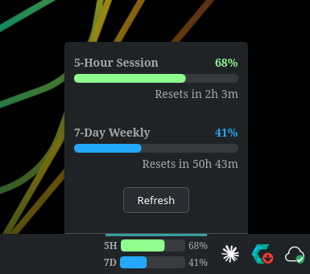

# Claude Usage Tracker

A KDE Plasma 6 panel widget that displays your Claude AI session (5-hour) and weekly (7-day) usage limits as live progress bars.



You can put it on the desktop or the panel, and if you click on it, the pop-up menu expands to show a Refresh button to force a fresh API pull, and you can also see when the limits reset.

## Requirements

- KDE Plasma 6
- Python 3.10+
- Python `cryptography` package (`pip install cryptography`)
- `qdbus6` (included with KDE Plasma 6)
- KWallet (must be unlocked — happens automatically on KDE login)
- systemd (standard on modern Linux)
- **Claude Desktop** installed and signed in

## Install

```bash
unzip CUT-v1.1.2.zip
cd CUT-v1.1.2
chmod +x install.sh
./install.sh
```

**Important:** You must log out and log back in after installing for the widget to work. This is because the installer sets an environment variable (`QML_XHR_ALLOW_FILE_READ=1`) that Qt needs to allow the widget to read local files.

After logging back in:
1. Right-click your panel → **Add Widgets**
2. Search for "Claude Usage Tracker"
3. Drag it onto your panel

## Uninstall

```bash
chmod +x uninstall.sh
./uninstall.sh
```

## How It Works

- A Python backend decrypts your OAuth token from Claude Desktop's encrypted token cache (`~/.config/Claude/config.json`) using your KWallet password, then polls the Anthropic usage API every 5 minutes
- If Claude Desktop credentials aren't available, Claude Code (`~/.claude/.credentials.json`) is used as a fallback
- Usage data is written to `~/.local/share/cut/usage.json`
- The Plasma widget reads that file every 60 seconds and displays two progress bars
- Color coding: green/blue (normal) → orange (>70%) → red (>90%)

## File Locations

| File | Path |
|------|------|
| Backend script | `~/.local/share/cut/claude_usage.py` |
| Usage data | `~/.local/share/cut/usage.json` |
| systemd service | `~/.config/systemd/user/claude-usage-tracker.service` |
| Plasma widget | `~/.local/share/plasma/plasmoids/com.github.trixles.claudeusagetracker/` |
| Env config | `~/.config/environment.d/cut.conf` |

## Troubleshooting

**Widget shows "–%" or no data:**
- Check the backend is running: `systemctl --user status claude-usage-tracker.service`
- Check logs: `journalctl --user -u claude-usage-tracker.service -f`

**"No credentials found" error in logs:**
- Make sure Claude Desktop is installed and you're signed in
- Make sure KWallet is unlocked (it should be automatically after login)

**KWallet not available after reboot:**
- The backend retries KWallet for up to 30 seconds on startup — this is normal
- If it still fails, try restarting the service: `systemctl --user restart claude-usage-tracker.service`

**Missing `cryptography` package:**
- Run: `pip install cryptography`
- Or with pipx isolation issues: `pip install --user cryptography`

**Widget not appearing in Add Widgets:**
- Make sure you logged out and back in after install
- Try: `killall plasmashell; plasmashell &`

**After updating, widget looks the same:**
- Remove the widget from your panel and re-add it to force Plasma to reload the cached popup size

## Changelog

See [CHANGELOG.md](CHANGELOG.md) for full version history.
